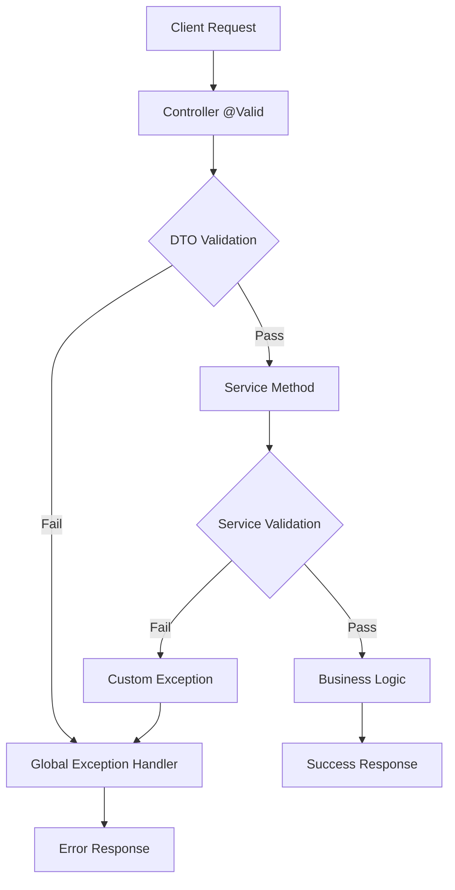

# Input Validation Strategy

This document describes the comprehensive input validation strategy implemented in the GitHub PR Reviewer application.

## Overview

The application implements a **multi-layered validation approach** that provides validation at both the DTO level (using Bean Validation annotations) and the service level (using custom validation logic). This ensures robust input validation and provides clear, consistent error messages.

## Validation Layers

### 1. DTO Level Validation (Bean Validation)

**Location**: `ReviewRequest` DTO  
**Trigger**: Automatically triggered when `@Valid` annotation is used in controller  
**Purpose**: Early validation before business logic execution

#### Repository Validation
- **Annotation**: `@ValidRepository`
- **Rules**:
  - Must not be null or empty (handled by `@NotBlank`)
  - Must follow format: `owner/repo`
  - Owner and repo names can contain: alphanumeric characters, dots, underscores, hyphens
  - Must not start or end with special characters (dots, underscores, hyphens)
  - Must contain exactly one forward slash

#### PR Number Validation
- **Annotations**: `@NotNull`, `@Positive`, `@ValidPrNumber`
- **Rules**:
  - Must not be null
  - Must be a positive integer
  - Must be between 1 and 999,999 (reasonable bounds)

### 2. Service Level Validation

**Location**: `ReviewService` class  
**Trigger**: Called explicitly in service methods  
**Purpose**: Business logic validation and additional security checks

#### Repository Validation
```java
private void validateRepository(String repo) {
    if (!StringUtils.hasText(repo)) {
        throw new ValidationException("Repository cannot be empty", "repository", repo);
    }
    
    if (!repo.matches("^[a-zA-Z0-9._-]+/[a-zA-Z0-9._-]+$")) {
        throw new ValidationException(
            "Repository must be in format 'owner/repo'", 
            "repository", 
            repo
        );
    }
}
```

#### PR Number Validation
```java
private void validatePrNumber(int prNumber) {
    if (prNumber <= 0) {
        throw new ValidationException(
            "Pull request number must be positive", 
            "prNumber", 
            prNumber
        );
    }
}
```

## Custom Validation Annotations

### @ValidRepository

**Purpose**: Validates GitHub repository format  
**Pattern**: `^[a-zA-Z0-9]([a-zA-Z0-9._-]*[a-zA-Z0-9])?/[a-zA-Z0-9]([a-zA-Z0-9._-]*[a-zA-Z0-9])?$`

**Valid Examples**:
- `octocat/Hello-World`
- `user123/repo-456`
- `user_name/repo.name`
- `user-name/repo-name`

**Invalid Examples**:
- `invalid-repo-format` (no slash)
- `owner/repo/subdir` (multiple slashes)
- `_owner/repo` (starts with underscore)
- `owner/repo_` (ends with underscore)
- `/repo` (empty owner)
- `owner/` (empty repo)

### @ValidPrNumber

**Purpose**: Validates GitHub pull request numbers  
**Range**: 1 to 999,999

**Valid Examples**:
- `1` (minimum)
- `12345` (middle range)
- `999999` (maximum)

**Invalid Examples**:
- `0` (below minimum)
- `-1` (negative)
- `1000000` (above maximum)

## Validation Flow



## Error Response Examples

### Repository Format Error
```json
{
  "error": "Validation Error",
  "message": "Repository 'invalid-repo' must be in format 'owner/repo' (e.g., 'octocat/Hello-World')",
  "status": 400,
  "path": "/api/review",
  "timestamp": "2024-01-15T10:30:00.000"
}
```

### PR Number Error
```json
{
  "error": "Validation Error",
  "message": "Pull request number 0 must be at least 1",
  "status": 400,
  "path": "/api/review",
  "timestamp": "2024-01-15T10:30:00.000"
}
```

### Multiple Validation Errors
```json
{
  "error": "Validation Error",
  "message": "Invalid request parameters",
  "status": 400,
  "path": "/api/review",
  "timestamp": "2024-01-15T10:30:00.000",
  "fieldErrors": [
    {
      "field": "repository",
      "rejectedValue": "invalid-repo",
      "message": "Repository 'invalid-repo' must be in format 'owner/repo'"
    },
    {
      "field": "prNumber",
      "rejectedValue": 0,
      "message": "Pull request number 0 must be at least 1"
    }
  ]
}
```

## Testing Strategy

### Unit Tests
- **RepositoryValidatorTest**: Tests all repository format scenarios
- **PrNumberValidatorTest**: Tests all PR number range scenarios
- **ReviewRequestValidationTest**: Integration tests for DTO validation

### Test Coverage
- ✅ Valid inputs (all formats)
- ✅ Invalid repository formats
- ✅ Invalid PR numbers (negative, zero, too large)
- ✅ Null and empty values
- ✅ Multiple validation errors
- ✅ Edge cases and boundary conditions

## Benefits

### 1. **Defense in Depth**
- Multiple validation layers prevent invalid data from reaching business logic
- DTO validation catches errors early in the request pipeline
- Service validation provides additional business rule enforcement

### 2. **Consistent Error Messages**
- Standardized error response format
- Clear, actionable error messages
- Field-level error details for complex validation failures

### 3. **Type Safety**
- Custom validation annotations provide compile-time safety
- Reusable validation logic across different DTOs
- IDE support for validation annotations

### 4. **Performance**
- Early validation prevents unnecessary processing
- Efficient regex patterns for format validation
- Minimal overhead for valid inputs

### 5. **Maintainability**
- Centralized validation logic
- Easy to modify validation rules
- Comprehensive test coverage

## Usage Examples

### Valid Request
```bash
curl -X POST http://localhost:8080/api/review \
  -H "Content-Type: application/json" \
  -d '{
    "repository": "octocat/Hello-World",
    "prNumber": 123,
    "postToGitHub": false
  }'
```

### Invalid Repository Format
```bash
curl -X POST http://localhost:8080/api/review \
  -H "Content-Type: application/json" \
  -d '{
    "repository": "invalid-repo-format",
    "prNumber": 123,
    "postToGitHub": false
  }'
```

### Invalid PR Number
```bash
curl -X POST http://localhost:8080/api/review \
  -H "Content-Type: application/json" \
  -d '{
    "repository": "octocat/Hello-World",
    "prNumber": 0,
    "postToGitHub": false
  }'
```

## Configuration

### Validation Dependencies
The validation is enabled by default with Spring Boot Starter Validation:

```gradle
implementation 'org.springframework.boot:spring-boot-starter-validation'
```

### Custom Validators
Custom validators are automatically registered with the Bean Validation framework and can be used anywhere in the application.

## Best Practices

1. **Use DTO validation for input sanitization**
2. **Use service validation for business rules**
3. **Provide clear, actionable error messages**
4. **Test all validation scenarios thoroughly**
5. **Keep validation patterns simple and efficient**
6. **Document validation rules clearly**
7. **Use appropriate HTTP status codes for different error types**

## Future Enhancements

1. **Rate limiting validation** - Prevent abuse of the API
2. **Repository existence validation** - Verify repository exists on GitHub
3. **PR existence validation** - Verify PR exists in the repository
4. **Content length validation** - Limit review content size
5. **Internationalization** - Support multiple languages for error messages
